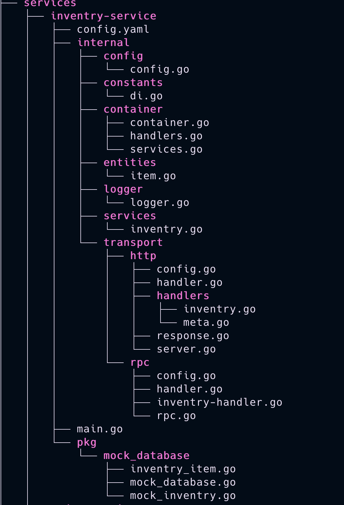

## Golang Microservices Home Assignment
## Project: "Resilient Order Processing System"

### Task Overview: 
Build a simple order processing system using microservices architecture that demonstrates handling distributed transactions with the Saga pattern, gRPC communication,
and the ability to handle spike loads.
### Requirements:
1. Microservices Structure:
  -  Create 3 microservices: Order Service, Payment Service, and Inventory Service `completed` 
  -  Implement gRPC for inter-service communication `completed` 
2. Saga Pattern Implementation:
  - Implement a distributed transaction flow for order processing `partially completed`
  - Handle compensation transactions for failure scenarios (e.g., payment
failure, inventory unavailable) `completed`
3. Resilience & Scaling:
  - Include a simple load testing script to demonstrate handling spike loads  `completed`
4. Containerization: Provide Docker files and Docker Compose for easy setup and
testing  `completed`

### Deliverables:
  - GitHub repository with complete code `completed`
  - README with setup instructions  `completed`

## project Structure
  
  -  main.go
    path cmd/main.go  
    in main file i am starting 3 goroutines to run 3 microservices as there is only one repo so all of the code structure is according to support that architecture but in prod environments it is better to go with separate code base
    ```golang
      go inventryservice.StartInventryService(ctx, wg)
      go orderservice.StartOrderService(ctx, wg)
      go paymentservice.StartPaymentService(ctx, wg)
    ``` 
## service-folder-structure
  
  - micro-svc starts from the main.go in the main directory
  - every service uses its own config located in main directory of the service
  - i am using dependency injection pattern and for that i am using the "github.com/sarulabs/di" package  
  every service is started in its own module or container more specific
  - services are being exposed to the outer world either by http in transport directory or by rpc in transport directory

  - as the 6 hours were very less for this task the best solution to come up with to explain my ability was to work with a mock-database to store the transactional record and to keep the things as smooth as they can be

  - every rpc/http end point is controlled by handlers and from the handlers to svc which execute the bussiness logic and have the access to repos and apis

## Working flow

## API Endpoints

### 1. Get Inventory Stocks
Fetch all available inventory items from the inventry svc

**Request:**
```bash
curl --location 'http://localhost:8000/inventry/stocks/'
```

**Response:**
```json
{
  "status": 200,
  "success": true,
  "meta": null,
  "data": [
    {"Id": "0ec2fe2b-d061-43cd-a16e-672d2662e6fe", "name": "item1", "count": 10},
    {"Id": "154ffd4d-ac59-4819-a2fc-194faf1b92ba", "name": "item2", "count": 10}
  ]
}
```

### 2. Place an Order
Place an order for inventory items with uuid from the list this api call is to order service

**Request:**
```bash
curl --location 'http://localhost:8000/orders/place' \
--header 'Content-Type: application/json' \
--data '{
  "list": [
    {
      "id": "dad78a5a-3c27-449f-8696-fd745260884e",
      "count": 2
    }
  ]
}'
```

### 3. Check Order Status
As the requirements were for distributed transaction so to implement this requirements time given was way less than it require and during the weekdays when someone is doing the 8 - 10 hours job 
as the order is placed immediately and wait for the transaction verification that is not implemented yet

Get the status of a placed order.

**Request:**
```bash
curl --location 'http://localhost:8000/orders/status/?order_id=FEE4C0AF-6BEA-49AF-81F2-E9E63CC98555'
```

**Response (example if not found):**
```json
{
  "status": 500,
  "success": false,
  "meta": null,
  "data": "no record found"
}
```

### 3. payment

As the requirements were for distributed transaction so the payment is added to the database and event is generated to corresponding listener like order service to update the status of the order(not implemented)

Get the status of a placed order.

**Request:**
```bash
      curl --location 'http://localhost:7710/payment/pay' \
--header 'Content-Type: application/json' \
--data '{
  "list": [
    {
      "id": "bdc38c99-c74d-4053-8897-7ea0dbd428f8",
      "order_id": "bdc38c99-c74d-4053-8897-7ea0dbd423f8"
    }
  ]
}
'
```

**Response :**
```json
{"status":200,"success":true,"meta":null,"data":true}
```

## Setup Instructions

1. Generate gRPC code:
   ```bash
   make gen-rpc
   ```

2. Run tests:
   ```bash
   make tests
   ```

3. Lint the code:
   ```bash
   make lint
   ```

4. Build and start services:
   ```bash
   make docker-up
   ```

5. (Optional) Dry-run Docker startup:
   ```bash
   make docker-dryrun
   ```

6. (Optional) View container stats:
   ```bash
   make docker-stats
   ```

7. Stop services:
   ```bash
   make docker-down
   ```

---

---

## Requirements
- Go installed
- Docker installed and running
- `golangci-lint` installed
```

---

